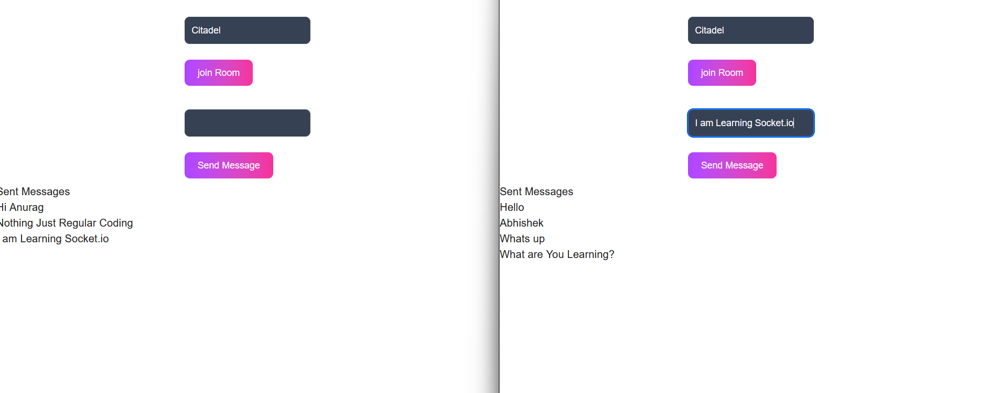

# 🔌 Introduction to Socket.IO

This project demonstrates a simple real-time chat application using **Socket.IO**, **Express (Node.js)** for the backend, and **React** with **Tailwind CSS** for the frontend.

---

## 📸 Preview



---

## 🧰 Tech Stack

- **Frontend:** React + Tailwind CSS + Socket.IO Client  
- **Backend:** Node.js + Express + Socket.IO  
- **Communication:** WebSockets using Socket.IO  

---

## 🚀 Features

- Real-time messaging between clients
- Join specific chat rooms
- Message broadcasting within rooms
- Socket connection and disconnection logs

---

## 📦 Installation

### Clone the repository:

```bash
git clone https://github.com/yourusername/socketio-intro.git
cd socketio-intro
